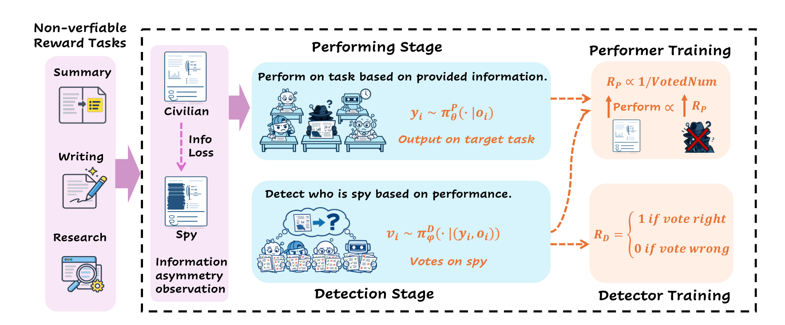
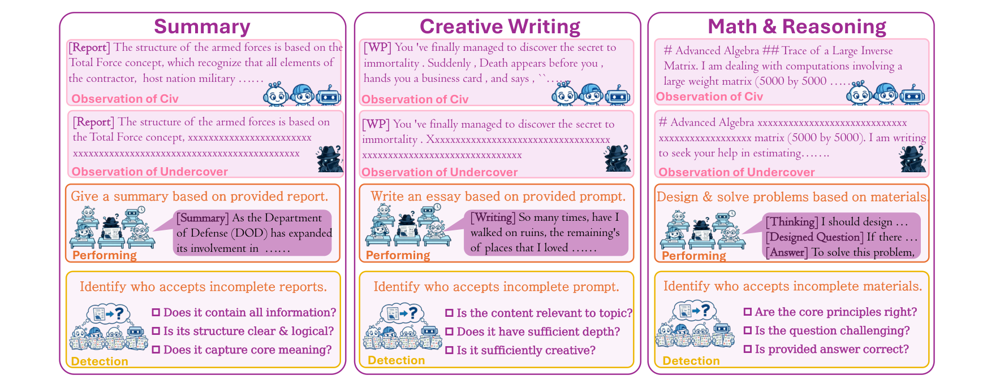

<div align="center">

# 🕵️ SpyRL: Self-PlaY Reinforcement Learning
### From RLVR to RLSVR: Task Transformation Induces Self-Verifiable Rewards for Open-Ended LLM Self-Improvement

> **🎉 Accepted to COLM 2026!**

[](https://arxiv.org/abs/2607.23802)
[](LICENSE)
[](https://huggingface.co/SpyRL)
[](https://github.com/volcengine/verl)



*Self-supervised learning, but for RLVR. We transform an open-ended task into a multi-agent game
whose rules automatically generate fully verifiable rewards, enabling scalable LLM self-improvement
beyond math and code.*

</div>

> ### 🎯 This repository also hosts **Vision-Zero** (ICLR 2026)
> **[Vision-Zero: Scalable VLM Self-Improvement via Strategic Gamified Self-Play](https://github.com/wangqinsi1/RLSVR/tree/vision-zero)** —
> the vision-language counterpart, where the same self-play idea runs on image pairs.
> **→ Code on the [`vision-zero`](https://github.com/wangqinsi1/RLSVR/tree/vision-zero) branch**

## 📋 Table of Contents

- [🎯 Overview](#-overview)
- [📊 Performance Results](#-performance-results)
- [🤖 Models](#-models)
- [🚀 Quick Start](#-quick-start)
- [🎲 How the Game Works](#-how-the-game-works)
- [📂 Repository Structure](#-repository-structure)
- [💪 Training](#-training)
- [📊 Evaluation](#-evaluation)
- [📄 Citation](#-citation)

---

## 🎯 Overview

Drawing on the principle of self-supervised learning, which constructs pretext tasks to derive
supervision from the data itself, we propose **Reinforcement Learning with Self-Verifiable Rewards
(RLSVR)**, a task-transformation-based training paradigm for extending RLVR to open-ended tasks.
RLSVR transforms open-ended tasks into verifiable proxy environments whose internal rules and
interaction outcomes automatically generate reward signals.

We instantiate RLSVR with **SpyRL**, a multi-agent self-play environment inspired by *Who Is the
Spy?*. Agents receive asymmetric information, complete the same target task, and vote to identify a
designated spy. Because the spy identity is predetermined, voting outcomes provide fully verifiable
rewards, while successful identification remains closely related to output quality.

> 🏆 On Qwen3-8B, SpyRL reaches **75.4%** and **77.3%** A/B win rates on summarization and creative
> writing, and improves Qwen3-4B/8B by **8.97%** and **6.16%** on mathematical reasoning across seven
> benchmarks — while R-Zero and Absolute Zero yield only marginal gains on the open-ended tasks.

### ✨ Key Features

<details>
<summary><b>🎮 Self-play beyond verifiable domains</b></summary>

Prior self-play frameworks (R-Zero, Absolute Zero) are proposer–solver loops that need a verifiable
solver signal to steer difficulty. SpyRL needs none: the reward comes from the *rules of the game*,
so it extends to summarization and creative writing where no ground truth exists.

</details>

<details>
<summary><b>🔍 Verifiable rewards without a verifier</b></summary>

The environment assigns the spy identity, so `r_D = 1[vote == spy]` is checkable by construction. The
performing reward is a zero-sum function of the vote counts, keeping the spy and the civilians in
genuine competition instead of drifting together.

</details>

<details>
<summary><b>🗳️ Collective, not pointwise, judgement</b></summary>

Every player votes, and rewards are normalized within the group (GRPO-style). One detector's
misjudgement is outvoted rather than becoming the whole learning signal — far more robust than
single-verifier pipelines.

</details>

<details>
<summary><b>📄 Cheap document-level data</b></summary>

The performing stage only needs raw documents — reports, story prompts, math-heavy web text. No
question-level supervision, no labels, no preference pairs. Swapping domains means swapping a corpus.

</details>

---

## 📊 Performance Results

### 📝 Summarization

ROUGE-L and GPT-4o A/B win rate (%) against the untrained base model.

| Method | GovReport | | Multi-News | | QmSum | | VcSum | | SamSum | |
|---|---|---|---|---|---|---|---|---|---|---|
| | ROUGE | A/B | ROUGE | A/B | ROUGE | A/B | ROUGE | A/B | ROUGE | A/B |
| Qwen3-4B | 30.2 | 51.2 | 23.1 | 52.1 | 21.3 | 52.4 | 15.1 | 51.8 | 43.2 | 50.9 |
| + R-Zero | 32.1 | 56.8 | 22.4 | 48.2 | 21.5 | 55.2 | 15.6 | 51.2 | 42.8 | 48.1 |
| + Absolute Zero | 33.2 | 58.8 | 25.2 | 61.2 | 22.7 | 56.4 | 18.3 | 62.8 | 46.1 | 68.5 |
| **+ SpyRL** | **36.7** | **74.6** | **26.4** | **80.2** | **25.3** | **68.4** | **19.1** | **70.2** | **48.2** | **76.2** |
| Qwen3-8B | 29.0 | 50.2 | 23.1 | 51.4 | 19.2 | 52.8 | 14.9 | 53.1 | 44.3 | 51.6 |
| + R-Zero | 29.4 | 51.3 | 22.2 | 50.2 | 18.8 | 47.9 | 14.9 | 55.3 | 44.8 | 52.9 |
| + Absolute Zero | 32.5 | 62.5 | 23.2 | 50.3 | 19.1 | 53.2 | 15.8 | 58.2 | 46.2 | 70.6 |
| **+ SpyRL** | **34.1** | **78.2** | **25.8** | **68.5** | **23.2** | **78.2** | **19.1** | **72.5** | **48.5** | **79.5** |

### ✍️ Creative Writing

A/B win rate (%) against the untrained base model, judged on four criteria.

| Method | WritingPrompts | | | | | WritingBench | | | | |
|---|---|---|---|---|---|---|---|---|---|---|
| | Novel | Emotion | Coher. | Consist. | **Overall** | Novel | Emotion | Coher. | Consist. | **Overall** |
| Qwen3-4B | 51.2 | 50.0 | 52.3 | 51.0 | 51.2 | 50.8 | 51.5 | 50.9 | 52.1 | 51.0 |
| + R-Zero | 48.3 | 44.3 | 51.2 | 48.8 | 48.8 | 46.5 | 46.5 | 43.2 | 46.2 | 46.5 |
| + Absolute Zero | 54.5 | 52.2 | 50.2 | 52.8 | 54.0 | 55.2 | 54.8 | 55.7 | 55.4 | 55.2 |
| **+ SpyRL** | **84.3** | **76.8** | **72.3** | **70.1** | **81.3** | **76.2** | **75.7** | **68.5** | **68.0** | **75.1** |
| Qwen3-8B | 52.2 | 51.8 | 50.6 | 51.0 | 51.5 | 50.4 | 51.1 | 51.3 | 52.4 | 51.8 |
| + R-Zero | 52.3 | 54.2 | 51.2 | 49.5 | 52.2 | 52.3 | 52.1 | 52.5 | 53.4 | 52.0 |
| + Absolute Zero | 55.3 | 52.8 | 57.4 | 56.8 | 56.4 | 56.5 | 55.8 | 58.2 | 57.9 | 58.1 |
| **+ SpyRL** | **77.3** | **76.2** | **74.2** | **75.0** | **76.5** | **78.1** | **77.4** | **71.0** | **71.2** | **78.1** |

### 🧮 Mathematical & General Reasoning

| Method | GSM8K | Math500 | AIME 24 | AIME 25 | Minerva | MMLU-Pro | GPQA-D |
|---|---|---|---|---|---|---|---|
| Qwen3-4B | 84.5 | 68.2 | 10.3 | 6.7 | 42.3 | 51.6 | 26.3 |
| + R-Zero | 88.7 | 72.8 | 10.3 | 6.7 | 47.1 | 52.8 | 27.8 |
| + Absolute Zero | 89.3 | 76.2 | 12.2 | 13.4 | 41.9 | 52.6 | 35.3 |
| **+ SpyRL** | **93.4** | **79.5** | **13.3** | **20.0** | **47.8** | **57.4** | **41.3** |
| Qwen3-8B | 91.8 | 74.2 | 15.3 | 12.1 | 49.3 | 58.1 | 33.3 |
| + R-Zero | 92.1 | 78.4 | 15.3 | 14.2 | 52.5 | 61.7 | 34.3 |
| + Absolute Zero | 92.0 | 76.6 | 18.4 | 18.2 | 52.9 | 62.5 | 36.8 |
| **+ SpyRL** | **93.5** | **81.2** | **20.0** | **23.3** | **56.3** | **63.1** | **39.8** |

> **Key insight:** the vote-based performing reward tracks real quality. Over 100 games, players who
> attracted more suspicion votes were consistently ranked lower by GPT-4o — the game measures what we
> actually care about, without ever asking a judge.

---

## 🤖 Models

All checkpoints are released under [🤗 SpyRL](https://huggingface.co/SpyRL) and load with plain
`transformers` — the chat template and tokenizer are inherited unchanged from the base model.

| Model | Base | Task | Headline result |
|---|---|---|---|
| [](https://huggingface.co/SpyRL/SpyRL-Qwen3-4B-Math) | Qwen3-4B-Instruct-2507 | Mathematical reasoning | +8.97% avg over 7 benchmarks |
| [](https://huggingface.co/SpyRL/SpyRL-Qwen3-8B-Math) | Qwen3-8B | Mathematical reasoning | +6.16% avg over 7 benchmarks |
| [](https://huggingface.co/SpyRL/SpyRL-Qwen3-4B-Writing) | Qwen3-4B-Instruct-2507 | Creative writing | 81.3% A/B win rate |
| [](https://huggingface.co/SpyRL/SpyRL-Qwen3-4B-Summarization) | Qwen3-4B-Instruct-2507 | Summarization | 74.6% A/B win rate, +6.5 ROUGE-L |

```python
from transformers import AutoModelForCausalLM, AutoTokenizer

model_id = "SpyRL/SpyRL-Qwen3-4B-Math"
tokenizer = AutoTokenizer.from_pretrained(model_id)
model = AutoModelForCausalLM.from_pretrained(model_id, torch_dtype="auto", device_map="auto")
```

No dataset release is needed — every task streams its corpus straight from the Hub
(`ccdv/govreport-summarization`, `euclaise/writingprompts`, `nvidia/Nemotron-CC-Math-v1`) and builds
the game on the fly.

---

## 🚀 Quick Start

Requires Python ≥ 3.10, CUDA 12.x, and a single node of 8 GPUs with ≥ 80 GB (the reference configs
use tensor parallel 8).

```bash
git clone -b SpyRL https://github.com/wangqinsi1/RLSVR.git
cd RLSVR

conda create -n spyrl python=3.10 -y && conda activate spyrl
bash setup.sh                       # verl core + vLLM + SpyRL deps, then a smoke check

bash spyrl/train_summarization.sh   # or train_creative_writing.sh / train_math_reasoning.sh
```

Corpora are pulled from the Hugging Face Hub on first use — nothing to download or preprocess by
hand. Set `HF_TOKEN` if a corpus requires authentication.

<details>
<summary><b>Installing without setup.sh</b></summary>

```bash
pip install -e ".[spyrl]"                      # verl core + vLLM + the SpyRL dependencies
pip install flash-attn --no-build-isolation    # optional, faster attention
python spyrl/check_install.py                  # verifies the agent loops reached verl's registry
```

`pip install .` (non-editable) works too — the launch scripts read the game environments from the
cloned tree, so keep the clone around either way.

</details>

---

## 🎲 How the Game Works



Each task instantiates the same two-stage game with a different information-degradation operator
`g(·)` and a different performing objective:

| Task | Corpus | What players do | The spy's handicap |
|---|---|---|---|
| **Summarization** | [`ccdv/govreport-summarization`](https://huggingface.co/datasets/ccdv/govreport-summarization) | Summarize a government report in one paragraph | 20% contiguous span of the report masked with `*` |
| **Creative writing** | [`euclaise/writingprompts`](https://huggingface.co/datasets/euclaise/writingprompts) | Write a story from a prompt | 20% contiguous span of the prompt masked with `*` |
| **Math reasoning** | [`nvidia/Nemotron-CC-Math-v1`](https://huggingface.co/datasets/nvidia/Nemotron-CC-Math-v1) | Design *and* solve a problem grounded in a document | 40% contiguous span of the document masked with `*` |

Detectors must answer inside `\boxed{...}` — a player number, or `N/A` when uncertain — which is what
the reward parser reads.

### The two rewards

**Detection** (verifiable — the environment knows who the spy is):

```
r_D(i) = 1[v_i == u]
```

normalized within the group of detectors, GRPO-style.

**Performing** (zero-sum over roles, driven entirely by the vote counts `m`):

```
r_P(spy)        = −β · (m_u − m̄_c)
r_P(civilian j) = (β / n_c) · (m_u − m̄_c) − λ · (m_j − m̄_c)
```

The first term keeps the spy and the civilians in direct competition; the second penalizes any
civilian who drew more suspicion than its peers, so "be good" concretely means "be better than the
others who saw the same thing." Because information asymmetry makes the two roles' raw reward
distributions incomparable, **Role-Advantage Estimation** subtracts a per-role EMA baseline before the
advantage is computed (`_RoleBaselines` in [`verl/utils/spyrl_reward.py`](verl/utils/spyrl_reward.py)).

### Alternating optimization

The two stages are trained in alternation, driven by a single flag:

| `trainer.training_phase` | Behaviour |
|---|---|
| `interactive` *(default)* | Alternates `decision` → `clue` every `interactive_cycle_length` steps |
| `clue` | Trains the performing stage only |
| `decision` | Trains the detection stage only |

In the `clue` phase one rollout is produced per player (`num_players × num_rounds`); in the `decision`
phase `rollout.n` detectors judge the same cached game. See
`RayPPOTrainer._get_interactive_training_phase` in
[`verl/trainer/ppo/ray_trainer.py`](verl/trainer/ppo/ray_trainer.py).

> ℹ️ The code says `clue` where the paper says *performing stage*, and `decision` where the paper says
> *detection stage*.

---

## 📂 Repository Structure

Everything specific to this paper lives in three places: the launch scripts under `spyrl/`, the agent
loops that play the game, and the datasets/rewards that define it.

```
SpyRL/
├── spyrl/                                  # ← start here: launch scripts
│   ├── README.md                           #   per-script reference
│   ├── env.sh                              #   shared paths, caches, model + GPU defaults
│   ├── train_summarization.sh              #   GovReport        (parallel performing stage)
│   ├── train_creative_writing.sh           #   WritingPrompts   (parallel performing stage)
│   ├── train_math_reasoning.sh             #   Nemotron-CC-Math (parallel performing stage)
│   ├── check_install.py                    #   post-install smoke check
│   └── ablations/                          #   sequential variants, without-spy, corpus swap
│
├── verl/experimental/agent_loop/           # game logic: one rollout = one full game
│   ├── govreport_parallel_agent_loop.py         # players write independently
│   ├── govreport_two_player_agent_loop.py       # players write in turn, seeing peers
│   ├── writingprompts_parallel_agent_loop.py
│   ├── writingprompts_two_player_agent_loop.py
│   ├── nemotron_cc_math_parallel_agent_loop.py
│   ├── nemotron_cc_math_two_player_agent_loop.py
│   └── nemotron_cc_math_no_spy_clue_agent_loop.py   # "Without spy" ablation
│
├── verl/utils/dataset/                     # environments: corpora, roles, prompts
│   ├── govreport_spotdiff_parallel_dataset.py     # + GovReportSpotDiffParallelPromptBuilder
│   ├── govreport_spotdiff_dataset.py
│   ├── writingprompts_spotdiff_parallel_dataset.py
│   ├── writingprompts_spotdiff_dataset.py
│   ├── nemotron_cc_math_spotdiff_parallel_dataset.py
│   ├── nemotron_cc_math_spotdiff_dataset.py
│   ├── nemotron_cc_math_no_spy_clue_dataset.py    # "Without spy" ablation
│   └── dclm_baseline_spotdiff_dataset.py          # corpus ablation
│
├── verl/utils/
│   ├── spyrl_reward.py                     # the two coupled rewards + Role-Advantage Estimation
│   └── spyrl_no_spy_reward.py              # reward for the "Without spy" ablation
├── verl/trainer/ppo/ray_trainer.py         # phase alternation + phase-dependent rollout repeat
└── setup.sh                                # one-click install
```

All three tasks come in two flavours, and every flavour is a `<dataset, agent loop>` pair:

- **parallel** — all players generate concurrently from their private observation. Nobody sees anyone
  else's output before the detection stage, and the spy's input is *partially* masked. This is what
  the main scripts run.
- **two_player** (sequential) — players speak in turn and each sees the transcript so far; the spy
  speaks last, so it can try to reconstruct what it is missing. The degradation is harsher here (no
  input at all for writing and math). Available under `spyrl/ablations/`.

---

## 💪 Training

```bash
bash spyrl/train_summarization.sh        # summarization on GovReport
bash spyrl/train_creative_writing.sh     # creative writing on WritingPrompts
bash spyrl/train_math_reasoning.sh       # math reasoning on Nemotron-CC-Math
```

Every knob has a default; override the common ones through the environment:

| Variable | Default | Meaning |
|---|---|---|
| `SPYRL_MODEL` | `Qwen/Qwen3-4B-Instruct-2507` | Base model for the actor and the reference policy |
| `SPYRL_OUTPUT_DIR` | `./outputs` | Where checkpoints and rollout transcripts land |
| `SPYRL_NUM_GPUS` / `SPYRL_NNODES` | `8` / `1` | GPUs per node (also the vLLM tensor-parallel size), nodes |
| `NUM_PLAYERS` | `5` (4 for GovReport) | Group size `n` |
| `MASK_FRACTION` | `0.2` / `0.4` | Fraction of the input masked for the spy (0.4 for math) |
| `TRAINING_PHASE` | `interactive` | `interactive` \| `clue` \| `decision` |
| `SPYRL_LOGGER` | `["console"]` | Passed to `trainer.logger`, e.g. `'["console","wandb"]'` |

```bash
SPYRL_MODEL=Qwen/Qwen3-8B NUM_PLAYERS=5 bash spyrl/train_summarization.sh
```

Anything else is a plain Hydra override appended to the command:

```bash
bash spyrl/train_math_reasoning.sh actor_rollout_ref.actor.optim.lr=5e-7 trainer.total_epochs=3
```

Each run writes checkpoints to `outputs/<experiment>/` and a human-readable transcript of one full
game per step to `outputs/<experiment>/rollouts.txt` — every player's prompt and output, the detector
prompt, each vote, whether it was correct, and the resulting rewards. If training looks odd, that file
is where the reason shows up:

```bash
tail -f outputs/govreport_summarization/rollouts.txt
```

Variants and ablations (sequential performing stage, "Without spy", non-math corpus) live in
[`spyrl/ablations/`](spyrl/ablations); see [`spyrl/README.md`](spyrl/README.md) for the full
per-script reference.

<details>
<summary><b>Reference hyperparameters</b></summary>

| Hyperparameter | Value |
|---|---|
| RL algorithm | GRPO |
| Learning rate | 1 × 10⁻⁶ |
| Prompts per batch × rollouts | 128 × 8 (effective batch 1024) |
| PPO mini-batch / micro-batch per GPU | 128 / 2 |
| KL penalty (low-variance KL) | 0.001 |
| Entropy coefficient | 0 |
| Group size `n` | 5 |
| Max prompt / response length | 12,288 / 4,096 |
| Max model length | 16,384 |
| Training iterations | 100 |
| Hardware | 1 node × 8 GPUs, vLLM TP = 8 |

</details>

---

## 📊 Evaluation

Training produces standard Hugging Face checkpoints under `outputs/<experiment>/`, so evaluation runs
with the usual tooling — no SpyRL-specific harness required:

- **Reasoning** (GSM8K, Math500, AIME, Minerva, MMLU-Pro, GPQA-Diamond) — e.g.
  [lm-evaluation-harness](https://github.com/EleutherAI/lm-evaluation-harness).
- **Summarization** — ROUGE-L on the five benchmark test sets, plus GPT-4o A/B win rate against the
  untrained base model.
- **Creative writing** — GPT-4o A/B win rate on novelty, emotion, coherence and consistency.

A/B evaluations aggregate results from swapped generation orders to cancel position bias.

---

## 📄 Citation

If you find SpyRL useful in your research, please consider citing:

```bibtex
@article{wang2026rlvr,
  title={From RLVR to RLSVR: Task Transformation Induces Self-Verifiable Rewards for Open-Ended LLM Self-Improvement},
  author={Wang, Qinsi and Shi, Jing and Wang, Huazheng and Wan, Kun and Wu, Yiran and Liu, Bo and Wu, Qingyun and Li, Hai Helen and Chen, Yiran and Zhao, Handong and others},
  journal={arXiv preprint arXiv:2607.23802},
  year={2026}
}
```

---

## 🙏 Acknowledgments

Built on [verl](https://github.com/volcengine/verl) (Apache 2.0) by the ByteDance Seed team and the
verl community. The upstream documentation lives at
[verl.readthedocs.io](https://verl.readthedocs.io/en/latest/) and applies to everything outside the
SpyRL-specific files listed above.

---

<div align="center">

**🌟 Star this repo if you find it helpful!**

</div>
